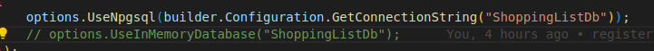

# Shopping List


## Requirements

- [Node 20](https://nodejs.org)
- [.NET 8](https://dotnet.microsoft.com)

## Usage

- First clone the repository

```sh
git clone https://github.com/kimfom01/ShoppingList.git
```

### Server

- Navigate to the `ShoppingList` directory

```sh
cd server/ShoppingList
```

- Restore dependencies

```sh
dotnet restore
```

- Run the server

```sh
dotnet run
```

- Open the swagger page [http://localhost:5224/swagger](http://localhost:5224/swagger)

> For testing purpose comment the `options.UseNpgsql` line and uncomment the `options.UseInMemoryDatabase` line in `server/ShoppingList/Program.cs` file
> 

### Frontend

- Navigate to the `shopping-list` directory

```sh
cd shopping-list
```

- Create .env file with the following variables

```plaintext
VITE_API_ROOT=http://localhost:5224/api/ShoppingList
```

- Install npm packages

```sh
npm install
```

- Run the app

```sh
npm run dev
```

- Open [http://localhost:3000](http://localhost:3000) in the browser
